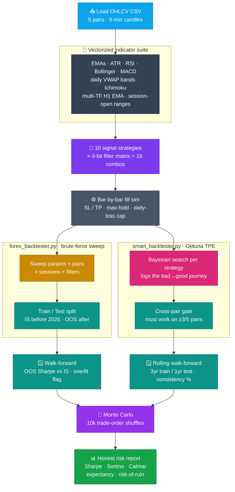

<div align="center">

# 📈 Forex Strategy Lab

### A rigorous, honest quantitative research engine for forex scalping strategies.

Most strategy backtesters are optimism machines — they sweep parameters until something looks profitable and quietly hide everything that didn't. **Forex Strategy Lab** does the opposite: it stress-tests **10 strategies** across **5 currency pairs**, **5 trading sessions**, and a **16-way signal-filter matrix**, then puts every survivor through **walk-forward, Monte-Carlo, and cross-pair gauntlets** — and reports the **losing** configurations just as plainly as the winning ones.


</div>

---

## ✨ What makes it rigorous

- **🧪 Honest validation, not cherry-picking.** Every config is split **in-sample / out-of-sample**, then re-run on the OOS slice. Any strategy whose out-of-sample Sharpe collapses below **50 % of its in-sample Sharpe** is explicitly **flagged as overfit** in the report — it is not silently dropped.
- **🎲 10,000-shuffle Monte Carlo.** The top configs have their trade sequence reshuffled thousands of times to estimate the **distribution** of outcomes (median / 5th / 95th-percentile final equity and max drawdown) and a **risk-of-ruin proxy** — because one lucky ordering of trades proves nothing.
- **🌐 Cross-pair robustness gating.** A strategy only earns the **"Universal"** label if it stays profitable on **≥ 3 of the 5 pairs**. A pattern that only works on EURUSD is treated as a curve-fit, not an edge.
- **🪟 Rolling walk-forward.** A **3-year-train / 1-year-test** window slides across the entire history; the report shows the **consistency %** — what fraction of those independent year-long windows actually made money.
- **📉 It reports losers truthfully.** Strategy rankings include the unfiltered, all-filters-on, and per-session breakdowns side by side. If a strategy bleeds pips, you see the negative number — the whole point is to find the rare honest edge, not to flatter the author.
- **⚙️ Realistic fill simulation.** Bar-by-bar SL/TP execution with a max-hold timeout, a **per-day loss cap** (28 % of account), pip-accurate P&L per symbol, and concurrency limits — not a naive vectorized "close-to-close" fantasy.

## 🧩 Pipeline

Two engines share the same indicator core and honest-validation philosophy, but discover strategies differently — one by **exhaustive brute force**, one by **Bayesian optimization**.



| Engine | Discovery method | Validation gauntlet | Output |
|--------|------------------|---------------------|--------|
| **`forex_backtester.py`** | Exhaustive fine-grid sweep (params × 5 pairs × 5 sessions × 16 filters) | Train/test split → walk-forward overfit flagging → 10k-shuffle Monte Carlo | `backtest_report.txt` (11 sections) |
| **`smart_backtester.py`** | **Optuna TPE** Bayesian search, per-strategy studies | Cross-pair "Universal" gate → rolling year-window walk-forward → Monte Carlo | `smart_report.txt` (10 sections) |

## 🧠 Strategies

Each strategy emits a `+1 / 0 / −1` signal plus ATR-scaled stop-loss and take-profit distances, then passes through the **4-bit filter matrix** (`RSI` · `MACD` direction · `min-ATR` · `spread proxy`).

**`forex_backtester.py` (10):**

| # | Strategy | Idea |
|---|----------|------|
| 1 | **EMA Scalper** | Trade pullbacks to a fast EMA in the direction of the fast/slow EMA trend |
| 2 | **Breakout** | Enter on a close beyond the Bollinger band after a volatility squeeze |
| 3 | **Mean Reversion** | Fade RSI extremes back toward the Bollinger mid-band |
| 4 | **News Momentum** | Ride outsized candles confirmed by three consecutive closes |
| 5 | **Market Maker** | Fade liquidity-spike candles against the spike direction |
| 6 | **Failed Breakout** | Fade long-wick rejections of the Bollinger bands back to the mean |
| 7 | **VWAP Reversion** | Fade price stretched beyond a std-dev band around the daily VWAP |
| 8 | **Session-Open Breakout** | Break the first-15-minute London / NY opening range |
| 9 | **Ichimoku Cloud** | Tenkan/Kijun cross confirmed by price on the right side of the cloud |
| 10 | **Multi-TF EMA** | M5 pullback entries gated by H1 EMA8/EMA21 alignment |

**`smart_backtester.py` (10):** EMA Crossover · EMA Pullback · Breakout · Mean Reversion · Momentum · Fade · Failed Breakout · VWAP Reversion · Ichimoku · Trend Follow — each with continuous parameter ranges that Optuna explores instead of a fixed grid.

## 🛠️ Tech stack

| Area | Tools |
|------|-------|
| **Core** | Pure **Python 3.10+** |
| **Numerics** | **NumPy** (vectorized indicators & signals) · **pandas** (OHLCV, resampling, VWAP) |
| **Optimization** | **Optuna** — TPE (Tree-structured Parzen Estimator) Bayesian sampler |
| **Validation** | Hand-rolled walk-forward, Monte Carlo (seeded `numpy` RNG), cross-pair gating |
| **I/O** | Reads one local CSV, writes one local `.txt` report — **no network, no broker, no API keys** |

## 🚀 Usage

```bash
# 1 — install dependencies
pip install -r requirements.txt

# 2 — drop your price file in place (see data/README.md for the format)
#     forex_backtester.py  → forex_5min_combined.txt
#     smart_backtester.py  → all_5pairs_daily.txt  (or pass --data)

# 3a — brute-force engine (full grid: all pairs × sessions × filters)
python forex_backtester.py

#      smoke test on a smaller slice (~10–12 min)
python forex_backtester.py --quick

# 3b — Optuna engine (defaults to daily data, auto-detects timeframe)
python smart_backtester.py

#      point it at the 5-minute file and search harder
python smart_backtester.py --data forex_5min_combined.txt --trials 2000

#      tune the Monte-Carlo depth
python smart_backtester.py --trials 5000 --mc-shuffles 5000
```

Each run prints live progress to the terminal and writes a full plain-text report
(`backtest_report.txt` / `smart_report.txt`) next to the script — including a
**copy-paste-ready bot config block** for the top configurations.

## 📊 What it reports

Both reports go well beyond a single equity curve:

- **Risk-adjusted return** — **Sharpe**, **Sortino** (downside-only), and **Calmar** (return ÷ max drawdown) ratios
- **Edge quality** — **expectancy** per trade (in pips and USD), **profit factor**, win rate
- **Survival** — **risk-of-ruin** proxy, max consecutive losses, drawdown depth & recovery time
- **Robustness** — in-sample vs out-of-sample Sharpe with **overfit flags**, rolling-window **consistency %**, and per-pair "Universal" status
- **Monte-Carlo distribution** — median / p5 / p95 final equity and max drawdown over thousands of trade-order shuffles
- **Recommended portfolio** — a 2–3 strategy blend chosen to maximize Sharpe while penalizing drawdown
- **Copy-paste bot configs** — the top-3 strategies serialized as ready-to-deploy parameter blocks

## ⚠️ Disclaimer

> **Educational and research use only — this is not financial advice.**
> Forex Strategy Lab is a backtesting and analysis tool. It does **not** connect to any
> broker and performs **no live trading**. Backtested and Monte-Carlo results are
> hypothetical; **past performance does not guarantee future results**. Trading leveraged
> FX carries substantial risk of loss. Do your own research and never risk capital you
> cannot afford to lose.

## 📄 License

[MIT](LICENSE) © 2026 Mohammed Abumtary

<div align="center"><sub>Built by <a href="https://github.com/Mohammed-AB">Mohammed Abumtary</a> · <a href="https://mohammed-ab.github.io">Portfolio</a></sub></div>
